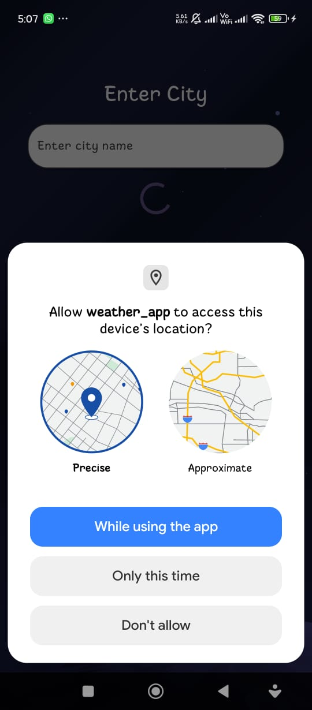
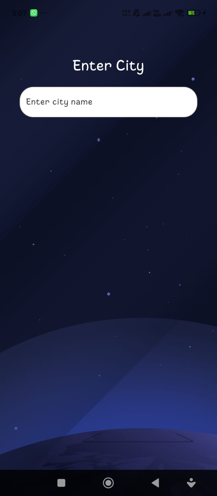
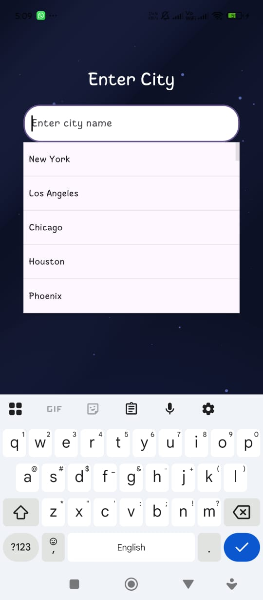
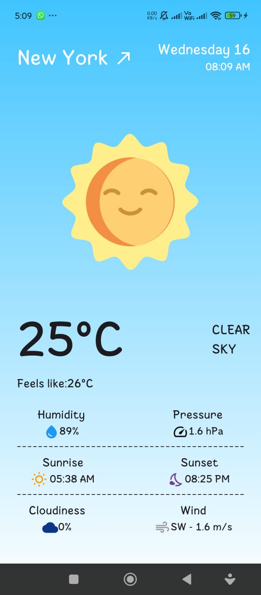
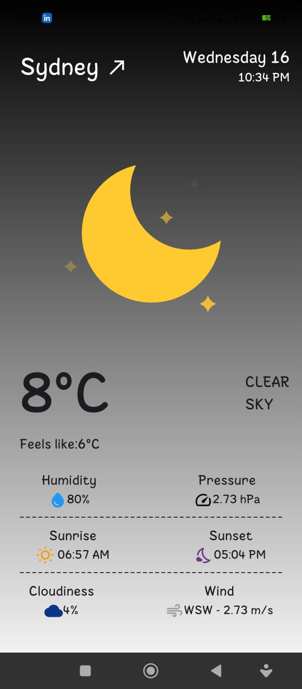
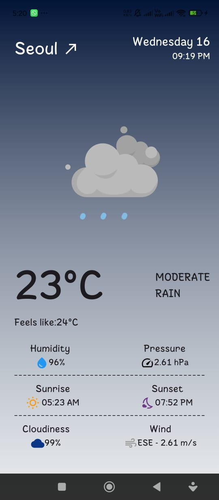
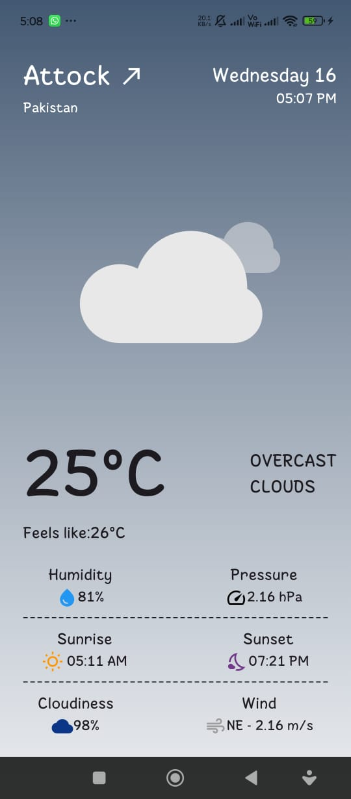
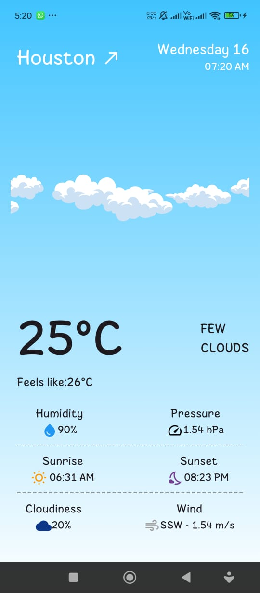
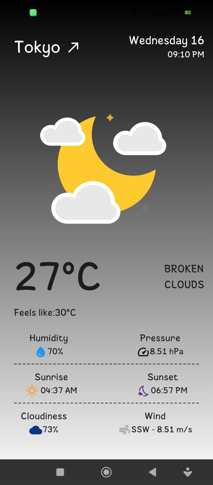

# 🌤️ Flutter Weather App

A minimal and beautiful Flutter weather application that shows the current weather based on your location or searched city using the OpenWeather API.

---

## 📌 Description

This app fetches and displays real-time weather data. Users can:

- View weather based on their **current location**
- Search for any **city’s weather**
- See weather animations using **Lottie**
- Experience UI changes based on **time of day** and **weather conditions**

---

## 🚀 Features

- 🌎 Get weather based on user’s current location
- 🔍 Search and display weather for any city
- 🎞️ Animated weather icons with Lottie
- 🌅 Dynamic UI that changes with time of day and weather
- 📅 Display formatted date and time using intl

---

## 🛠️ Tech Stack

- **Framework:** Flutter (Dart)
- **API:** OpenWeather API
- **Packages Used:**
  - http
  - lottie
  - intl
  - flutter_dotenv
  - flutter_dash
  - geocoding
  - geolocator
  - searchfield

---

## ⚙️ Installation & Setup

1. **Clone the repository**

   ```bash
   git clone https://github.com/callmeNoorulHuda/Weather_App.git
   ```

2. **Navigate to the project directory**

   ```bash
   cd your-repo
   ```

3. **Install dependencies**

   ```bash
   flutter pub get
   ```

4. **Add your OpenWeather API key**

    * Create a `.env` file in the root directory.

    * Add your API key as shown:

      ```
      API_KEY=your_openweather_api_key_here
      ```

   > ⚠️ *Note: Do not share your API key publicly.*

5. **Run the app**

   ```bash
   flutter run
   ```

---

## 📷 Screenshots

Below are screenshots showcasing different features and UI states of the app:

### 🗺️ Location Permission Screen

*Display shown when requesting user’s location permission.*



---
*Or you can enter city manually*



---




### 🌤️ Weather Screens

#### ☀️ Clear Day

*UI showing clear weather during daytime.*



---

#### 🌙 Clear Night

*UI showing clear weather during nighttime.*



---

#### 🌧️ Rainy Weather

*UI showing rainy weather with relevant animations.*



---

#### ☁️ Cloudy Weather

*UI showing cloudy weather condition.*



---

#### 🌨️ Snow Weather or Thunderstorm

*I couldn't find any city with snowing weather or thunderstorm*


---

### 🕐 Different Times of Day

*Showcasing UI changes according to time of day.*

| Morning                                    | Afternoon                                      | Evening      | Night      |
| ------------------------------------------ | ---------------------------------------------- | ------------ | ---------- |
|  |  |  |  |

---

## 🎥 Demo Video

*After uploading your demo video to LinkedIn, replace the link below.*

[🔗 Watch Demo on LinkedIn](https://www.linkedin.com/posts/noor-ul-huda19_flutter-dart-appdevelopment-activity-7351238883302326273-HJBr?utm_source=share&utm_medium=member_android&rcm=ACoAADPbO1UBX_Q9ScUgZgE4SmH6DYuAsFsH6As)

---

## 📄 Usage

1. **Grant location permission** when prompted to view weather based on your current location.
2. **Search** for any city using the search bar to view its weather details.
3. View **dynamic UI and weather animations** based on the current weather and time of day.

---

## 💡 Future Improvements

* Add hourly and weekly forecasts
* Implement theme switching (dark/light mode)
* Enhance UI with smooth transitions and gradients

---

## 🤝 Credits

* **OpenWeather** for weather data
* **LottieFiles** for animations

---

## 📜 License

Specify your license here if applicable.
For example:

```
MIT License
```

---

```
